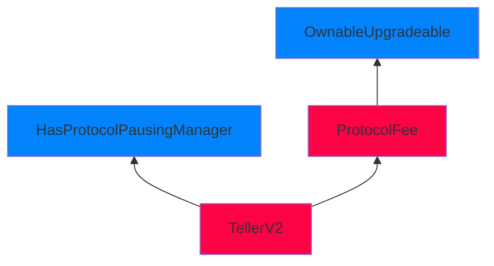

Faint Flaxen Pangolin

Medium

# `TellerV2.sol` inherits from `ProtocolFee.sol` contract that lacks storage gaps in a complex inconsistent inheritance chain, that will cause storage corruption in future contract upgrades.

### Summary

`TellerV2.sol`'s parent contracts implement storage gaps inconsistently across its inheritance chain. While some contracts like `HasProtocolPausingManager` properly implement storage gaps, `ProtocolFee` initializes upgradeability but lacks storage gaps which it **NEEDS**. This inconsistency in a complex, branched inheritance structure creates risks for future upgrades.

This vulnerablility finding aligns with Sherlock's validity rule which state:

_**"if the protocol design has a highly complex and branched set of contract inheritance with storage gaps inconsistently applied throughout and the submission clearly describes the necessity of storage gaps it can be considered a valid medium."**_

### Root Cause

The `TellerV2` contract has a complex inheritance structure where storage gaps are implemented inconsistently:



1. Contract inheritance structure:

```solidity
contract TellerV2 is
    ITellerV2,
    ILoanRepaymentCallbacks,
    OwnableUpgradeable,    // Has storage gaps
    ProtocolFee,           // Missing storage gaps despite upgradeability
    HasProtocolPausingManager,  // Has storage gaps
    TellerV2Storage,
    TellerV2Context
```
2. ProtocolFee.sol initializes upgradeability but lacks storage gaps:

```solidity
contract ProtocolFee is OwnableUpgradeable {
    uint16 private _protocolFee;
    
    function __ProtocolFee_init(uint16 initFee) internal onlyInitializing {
        __Ownable_init();  // Initializes upgradeability
        __ProtocolFee_init_unchained(initFee);
    }
    // No storage gaps implemented
}
```
3. In contrast, HasProtocolPausingManager.sol properly implements storage gaps:

```solidity
abstract contract HasProtocolPausingManager is IHasProtocolPausingManager {
    bool private __paused;
    address private _protocolPausingManager;
    
    // Properly implements storage gaps
    uint256[49] private __gap;
}
```
This inconsistency is particularly concerning because:

1. The inheritance structure is branched rather than linear, increasing complexity.
2. ProtocolFee is a concrete contract that's actively used in the inheritance chain.
3. The codebase shows awareness of proper upgradeability patterns (gaps in HasProtocolPausingManager) but fails to implement them consistently.

See: [https://docs.openzeppelin.com/contracts/4.x/upgradeable#storage_gaps](https://docs.openzeppelin.com/contracts/4.x/upgradeable#storage_gaps)

### Internal pre-conditions

_No response_

### External pre-conditions

_No response_

### Attack Path

Not Necessary

### Impact

The lack of storage gaps in ProtocolFee while implementing upgradeability creates a risk of storage collision during future upgrades. This is particularly problematic because:

- ProtocolFee is a concrete contract in active use
- It's part of a complex inheritance chain with multiple branches
- Other contracts in the same inheritance tree implement storage gaps, showing inconsistency in upgradeability pattern implementation

### PoC

Please refer to [TellerV2.sol](https://github.com/sherlock-audit/2024-11-teller-finance-update/blob/main/teller-protocol-v2-audit-2024/packages/contracts/contracts/TellerV2.sol#L49-L56) and ProtocolFee.sol

### Mitigation

Add storage gaps to ProtocolFee.sol to maintain consistency with other upgradeable contracts in the inheritance chain

```solidity
contract ProtocolFee is OwnableUpgradeable {
    uint16 private _protocolFee;
    
    function __ProtocolFee_init(uint16 initFee) internal onlyInitializing {
        __Ownable_init();
        __ProtocolFee_init_unchained(initFee);
    }
    
    // Add storage gaps
    uint256[49] private __gap;
}
```

This ensures all contracts in the inheritance chain consistently implement proper upgradeability patterns, reducing the risk of storage collisions in future upgrades.

Additionally, in ProtocolFee.sol and TellerV2.sol as a security best practice implement:

```solidity
constructor() {
    _disableInitializers();
}
```
This ensures:

1. The implementation contract can never be initialized directly.
2. All initialization must go through the proxy.
3. Prevents potential manipulation of the implementation's state.